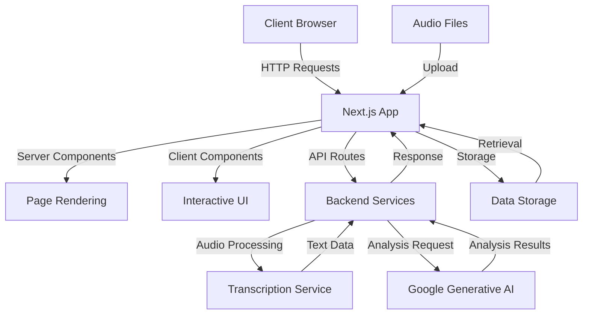
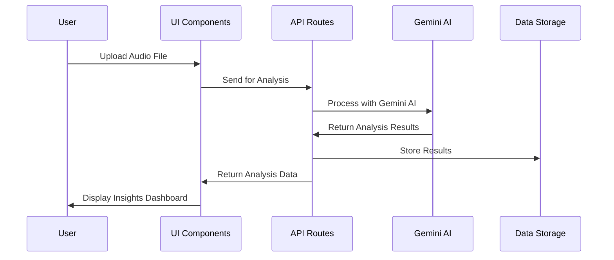

# 🔍 Call Analytics Platform

<div align="center">
  
  
  
  [](https://nextjs.org/)
  [](https://reactjs.org/)
  [](https://tailwindcss.com/)
  [](https://generativeai.google/)
  [](LICENSE)

  **Transform your customer conversations into actionable insights with AI-powered analytics**
</div>

---

## 📋 Table of Contents

- [Overview](#-overview)
- [Key Features](#-key-features)
- [Architecture](#-architecture)
- [Tech Stack](#-tech-stack)
- [Project Structure](#-project-structure)
- [Getting Started](#-getting-started)
- [Usage](#-usage)
- [API Implementation](#-api-implementation)
- [Deployment](#-deployment)
- [Contributing](#-contributing)
- [License](#-license)

---

## 🌟 Overview

Call Analytics is a sophisticated platform designed to analyze voice conversations and extract meaningful insights. By leveraging AI and machine learning technologies, our platform processes audio files to identify patterns, sentiment, key topics, and actionable items from customer interactions. This enables businesses to enhance communication strategies, improve customer satisfaction, and optimize team performance.

The platform features intuitive dashboards, detailed analytics, and comprehensive reporting tools that transform raw conversation data into strategic business intelligence.

---

## ✨ Key Features

### 🔹 Real-time Analytics
Monitor conversations as they happen with instant insights, trend detection, and live dashboards that keep you informed in the moment.

### 🔹 AI-Powered Insights
Our advanced machine learning algorithms analyze conversation patterns, sentiment shifts, and customer intent to reveal hidden opportunities.

### 🔹 Smart Transcription
Highly accurate, automated transcription with speaker recognition, intent detection, and contextual time-stamping capabilities.

### 🔹 Performance Metrics
Track team and individual performance with customizable KPIs that measure what matters most to your organization's success.

### 🔹 Enterprise Security
Bank-grade encryption and compliance frameworks ensure your data remains protected and meets industry regulations including GDPR and HIPAA.

### 🔹 Seamless Integration
Connect with your existing tech stack within minutes through our extensive API library and pre-built integrations with popular platforms.

---

## 🏗 Architecture

The application follows a modern architecture pattern with a Next.js frontend, integrating with Google's Generative AI for analysis processing.



### Data Flow



---

## 🛠 Tech Stack

- **Frontend Framework**: [Next.js 15.1.6](https://nextjs.org/)
- **UI Library**: [React 19.0.0](https://reactjs.org/)
- **Styling**: [TailwindCSS 3.4.1](https://tailwindcss.com/)
- **Charts & Visualization**: [Recharts 2.15.0](https://recharts.org/)
- **Icons**: [Lucide React 0.474.0](https://lucide.dev/)
- **AI Integration**: [Google Generative AI](https://generativeai.google/)
- **UI Components**:
  - Radix UI components
  - Custom-built interface elements
- **Type Checking**: [TypeScript](https://www.typescriptlang.org/)
- **Linting**: [ESLint](https://eslint.org/)

---

## 📁 Project Structure

```
call-analytics/
├── public/              # Static assets
├── src/
│   ├── app/             # Next.js App Router
│   │   ├── analytics/   # Analytics page and API
│   │   ├── components/  # Shared components
│   │   ├── dashboard/   # Dashboard pages
│   │   ├── features/    # Features page
│   │   ├── pricing/     # Pricing page
│   │   ├── layout.tsx   # Root layout
│   │   └── page.tsx     # Homepage
├── .gitignore           # Git ignore file
├── next.config.ts       # Next.js configuration
├── package.json         # Dependencies and scripts
├── postcss.config.mjs   # PostCSS configuration
├── tailwind.config.ts   # Tailwind CSS configuration
└── tsconfig.json        # TypeScript configuration
```

---

## 🚀 Getting Started

### Prerequisites

- Node.js 18+ 
- npm or yarn package manager

### Installation

1. **Clone the repository**

```bash
git clone https://github.com/yourusername/call-analytics.git
cd call-analytics
```

2. **Install dependencies**

```bash
npm install
# or
yarn install
```

3. **Environment Setup**

Create a `.env.local` file in the root directory with the following variables:

```
GEMINI_API_KEY=your_gemini_api_key_here
```

4. **Run the development server**

```bash
npm run dev
# or
yarn dev
```

5. **Open your browser**

Navigate to [http://localhost:3000](http://localhost:3000) to see the application.

---

## 📋 Usage

### Uploading Audio Files

1. Navigate to the Analytics page
2. Use the file upload component to select an audio file
3. Once uploaded, click "Analyze Call" to process the file
4. View the comprehensive analysis results including:
   - Speaker analysis
   - Conversation flow
   - Content analysis
   - Emotional analysis

### Dashboard Navigation

The application includes multiple dashboards:

- **Overview Dashboard**: High-level metrics and KPIs
- **Analytics Dashboard**: Detailed analytical insights
- **Calls Dashboard**: Individual call records and details
- **Users Dashboard**: Team member performance and activity

### Feature Exploration

Explore the various features available across different pricing tiers:

- Basic call analytics
- AI-powered insights
- Team performance optimization
- Sentiment analysis
- Topic detection
- Action item extraction

---

## 🔌 API Implementation

The application includes a robust API for call analysis, implemented in the `/analytics/api/analyze/` route.

### Key Components:

```typescript
// Main POST endpoint for audio analysis
export async function POST(request: Request): Promise<NextResponse> {
  try {
    // Get the form data from the request
    const formData = await request.formData();
    const audioFile = formData.get('audio') as File;

    // Initialize Gemini AI
    const genAI = new GoogleGenerativeAI(process.env.GEMINI_API_KEY!);
    const model = genAI.getGenerativeModel({ model: "gemini-1.5-flash" });

    // Process audio to text
    const transcript = await processAudioToText(audioFile);

    // Create analysis prompt and get analysis from Gemini
    const prompt = generateAnalysisPrompt(transcript);
    const result = await analyzeWithGemini(model, prompt);

    // Process and structure the analysis
    const structuredAnalysis = processAnalysis(result);

    return NextResponse.json(structuredAnalysis);
  } catch (error) {
    console.error('Error in analysis:', error);
    return NextResponse.json(
      { error: 'Failed to analyze audio' },
      { status: 500 }
    );
  }
}
```

The API processes audio files, extracts text, and uses Gemini AI to analyze the content, returning structured data about:

- Speaker metrics
- Conversation flow
- Content topics
- Emotional sentiment
- Key moments

---

## 📦 Deployment

### Build for Production

```bash
npm run build
# or
yarn build
```

### Start Production Server

```bash
npm run start
# or
yarn start
```

### Deployment Options

1. **Vercel** (Recommended)
   - Connect your GitHub repository
   - Vercel will automatically deploy your application

2. **Other Hosting Options**
   - Any platform supporting Node.js applications
   - Docker containerization
   - Traditional hosting with build output

---

## 👥 Contributing

We welcome contributions to the Call Analytics project!

1. Fork the repository
2. Create a feature branch (`git checkout -b feature/amazing-feature`)
3. Commit your changes (`git commit -m 'Add some amazing feature'`)
4. Push to the branch (`git push origin feature/amazing-feature`)
5. Open a Pull Request

Please ensure your code follows the existing style patterns and includes appropriate tests.

---

## 📄 License

This project is licensed under the MIT License - see the LICENSE file for details.

---

<div align="center">
  
  **Call Analytics** - Transform Conversations into Strategic Insights
  
  [Website](https://example.com) | [Documentation](https://example.com/docs) | [Support](mailto:support@example.com)
</div>
